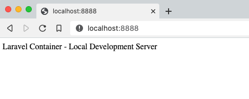

There's a lot of PHP code out there.  Wordpress, Drupal, Zend, Laravel.  These are just a few of the untold endless frameworks out there.  Even so, PHP has conspicuously been left out of the buzzword rich, serverless revolution.  Today's PHP developer might be asking, am I the last. A remaining holdout of a simpler, more complicated time.  It may be.  Surely the last ALGOL developer questioned the end before it came.

All of this PHP code has to go somewhere.  Cramming it into a Lambda function is just too messy.  There is Docker.  Docker is pretty great.  But up until now, Docker, in real life, meant managing a cluster.  Managing a cluster is not pretty great.   AWS Fargate ECS removes the cluster pain and makes Docker... serverless.

Follow along to create a raw Laravel Jetstream installation as a single task.  Get it to work on first on a dev machine and then in Fargate.  

#### Requirements:
- Docker [install](https://docs.docker.com/desktop/)
- NodeJS [install](https://nodejs.com)
- AWS Account [here](https://aws.amazon.com/)


#### Roadmap

- Create a Laravel capable docker container
- Create a local Laravel project using docker
- Create a production ready image
- Release to Fargate ECS


### Create the PHP Docker Container

First check if docker is installed properly.
```
docker run hello-world
```
Docker will download something and you should see a Hello from Docker! message in your terminal.


Create a new directory somewhere on your terminal.
```sh
cd ~/ && mkdir phplaravel && cd phplaravel
```
This will create a directory in your home folder named phplaravel.  Create an infrastructure directory to keep this code separated from the rest of the application.  Call the directory infra for short. 

Inside the infra directory create a file named Dockerfile. The tree stucture will so far looks like this. 

```sh
phplaravel
└── infra
    └── Dockerfile
 ```


Add the following commands to the Dockerfile. 
Dockerfile
```docker
FROM composer

RUN apk update && apk add nodejs npm
```

The Dockerfile will start off using the latest composer container provided in the docker containter repository.  Next it installs a few packages that Laravel will need to run.  


Build the image, login and take a look inside.
```sh
docker build -t phplaravel:latest -f infra/Dockerfile .

docker run --rm -it  phplaravel:latest bash

bash-5.0# php -v
PHP 7.4.11 (cli) (built: Oct  1 2020 20:01:20) ( NTS )
Copyright (c) The PHP Group
Zend Engine v3.4.0, Copyright (c) Zend Technologies

exit
```

This step is complete.  This container has all that is needed to create, edit and run a tutorialized, dockerized version of Laravel.

---


### Create A Local Laravel Project In Docker

The image is capable of running a dev version of Laravel.  This is a pared down, no frills version of Laravel but it does work.  To create a Laravel project on the host, that can be edited and run inside the container, follow along.


```
docker run --name phplaravel-container \
    --volume $(pwd):/phplaravel \
    -p 8888:8888 \
    -t -d --entrypoint /bin/bash phplaravel
```

The output will be a hash that looks something like this. 

d48565a9776120112b301489893565ee37cd076fc744b7ef29865dcb48a4f71b

Ignore it and login to the container.

```
docker exec -it phplaravel-container bash
```

Once inside the container, the command prompt will look like this.
```
bash-5.0# 
```

Switch to the /phplaravel directory and create a new Laravel project.
```
cd /phplaravel/

composer create-project --prefer-dist laravel/laravel laravel

cd laravel && composer require laravel/jetstream

php artisan jetstream:install inertia --teams

npm install && npm run dev
```

On the host machine there will be a new directory named **laravel**.  Make changes in this directory and those changes will be present inside the docker container.  This is a working dev version of Laravel Jetstream.  Almost.  

The app still needs a database.  To add one change the .env file and create a sqlite database following the instructions below.  First open the project in an editor.

Change the database section of the .env file.  

It starts off looking like this.
```
DB_CONNECTION=mysql
DB_HOST=127.0.0.1
DB_PORT=3306
DB_DATABASE=laravel
DB_USERNAME=root
DB_PASSWORD=
```

Remove those lines and replace it with this one line.
```
DB_CONNECTION=sqlite
```

Next create a new, empty file named database.sqlite in the database directory of the Laravel project. 
```
/phplaravel/laravel/app/database/database.sqlite
```

Back in the terminal of the docker instance migrate the database.  Then, serve the project.
```
php artisan migrate

php artisan serve
```

Open your browser and play around with Jetstream. <a href="http://localhost:8888/dashboard" target="_blank">Click</a>

---


### Create A Production Ready Image


```
docker rm phplaravel-container -f

docker build -t phplaravel:latest -f Dockerfile .

docker run --name phplaravel-container  -t -d phplaravel

docker exec -it phplaravel-container bash 
```

Go ahead and build an image.  Start a container, name it something useful. Then login using the following commands.


First we destroyed the running container.  Then rebuild the latest image of phplarvel, started a new container and started a terminal window logged in as root.  Let's see if composer is working.

```
# composer
   ______
  / ____/___  ____ ___  ____  ____  ________  _____
 / /   / __ \/ __ `__ \/ __ \/ __ \/ ___/ _ \/ ___/
/ /___/ /_/ / / / / / / /_/ / /_/ (__  )  __/ /
\____/\____/_/ /_/ /_/ .___/\____/____/\___/_/
                    /_/
Composer version 1.10.13 2020-09-09 11:46:34

```

## Development
We have Docker and PHP setup with Composer.  We want to be able to run composer inside of the docker container,
then save those files into a git repository.  We could do this in a few ways.  The first way is login to the docker container and setup the git inside.  Then you can push the code out to GitHub and bring it back into your local machine, add the docker files then start copying the git repo back into docker in your build steps later on.  

The second way is to give docker access to a directory that it shares with your local system.  

This is the chicken and the egg part.  We want to create our files using the docker container but have then available to ouyr local system. To do this we will start docker using the --volume flag.

```
docker run --volume $(pwd):/root/phplaravel --name phplaravel-container -p 8000:8000 -t -d phplaravel

# or in windows

docker run --volume //c/Users/username/phplaravel:/root/phplaravel --name phplaravel-container  -t -d phplaravel
```

Now lets install Laravel inside the container.

```sh
$ cd /phplaravel

$ composer create-project --prefer-dist laravel/laravel app

Creating a "laravel/laravel" project at "./app"
Installing laravel/laravel (v8.1.0)
...
```

If you are editing your DockerFile in an IDE you will see the new app folder in your local phplaravel directory. 

```
$ cd phplaravel/app
$ php artisan serve --port 8888 --host 0.0.0.0
```

In your browser goto http://localhost:8888/ and laravel is running inside your container and exposed to the real world.

Let's make a change to the welcome blade so we know its working like we think. 

app/resources/views/welcome.blade.php
```
Laravel Container - Local Development Server
```

Save it and refresh your browser.  You should see something like the image below.
 



## Fargate

- create aws directory
- install cfn modules
- docker login to ecr 

```
aws ecr get-login-password --region us-east-2 | docker login --username AWS --password-stdin 541286214792.dkr.ecr.us-east-2.amazonaws.com

aws ecr create-repository --repository-name phplaravel

{
    "repository": {
        "repositoryArn": "arn:aws:ecr:us-east-2:541286214792:repository/phplaravel",
        "registryId": "541286214792",
        "repositoryName": "phplaravel",
        "repositoryUri": "541286214792.dkr.ecr.us-east-2.amazonaws.com/phplaravel",
        "createdAt": "2020-10-24T12:52:35-07:00",
        "imageTagMutability": "MUTABLE",
        "imageScanningConfiguration": {
            "scanOnPush": false
        },
        "encryptionConfiguration": {
            "encryptionType": "AES256"
        }
    }
}

aws ecr get-login-password --region us-east-2 | docker login --username AWS --password-stdin 541286214792.dkr.ecr.us-east-2.amazonaws.com

docker build -t phplaravel .

docker tag phplaravel:latest 541286214792.dkr.ecr.us-east-2.amazonaws.com/phplaravel:latest

docker push 541286214792.dkr.ecr.us-east-2.amazonaws.com/phplaravel:latest

# interating updates
docker build -t phplaravel -f infra/prod/Dockerfile .

```

- build cloudformation and deploy

- get the out put URL from the stack

- its working

## Update the container

That's a serverless docker container that spins up from our image.  Let's change the home view and update.


app/resources/views/welcome.blade.php
```
Laravel Container - Fargate ECS
```

- rebuild the container locally

```
docker build -t phplaravel -f infra/prod/Dockerfile .
```

- push the latest out to ECR

```
docker tag phplaravel:latest 541286214792.dkr.ecr.us-east-2.amazonaws.com/phplaravel:latest
```

- create a new 


